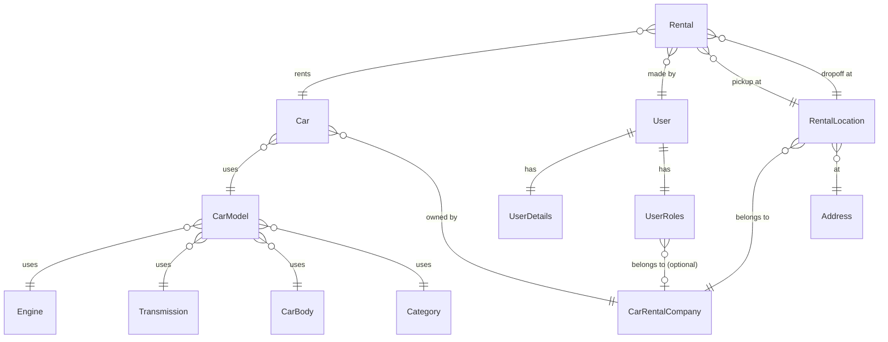
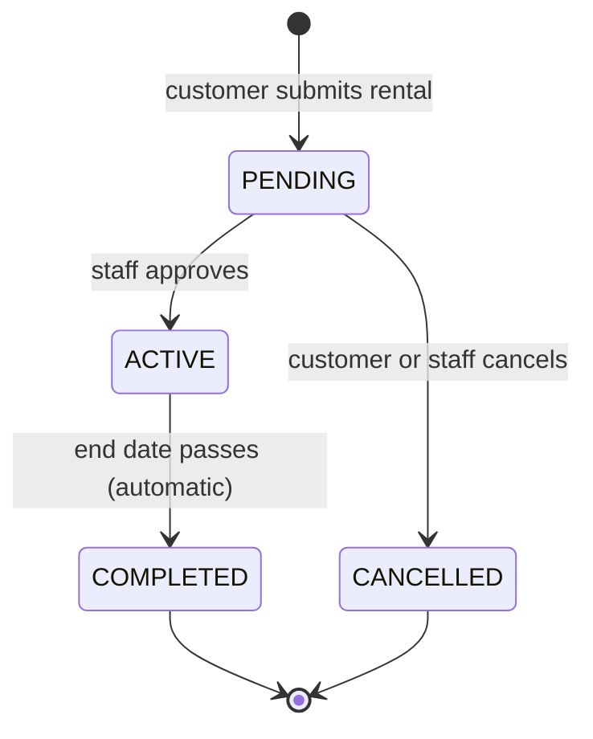
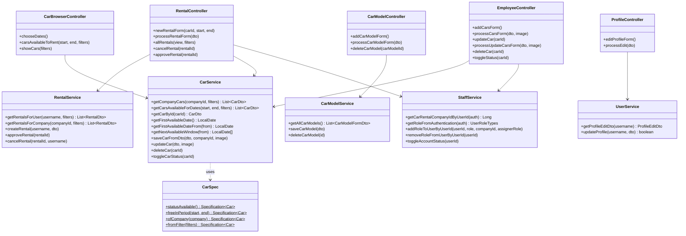

# Car Rental App — v2

Spring Boot web application for managing a car rental business. Supports multiple companies, roles, car fleet management, and customer rentals.

---

## Overview

### Functionality

The application covers two main domains:

**Fleet management** — Employees and managers manage the company's car fleet. Car models are built from reusable components (engine, transmission, car body, category). Individual cars reference a model and belong to a company. Cars can be added, updated, toggled between available/in-service, and deleted. Component pages show existing entries alongside the add form and prevent deletion of anything still referenced.

**Rentals** — Customers browse available cars for a chosen date range, filtered by brand, body type, category, transmission, traction type, and year. They submit a rental request with pickup/dropoff addresses and optional extras (driver, child seat). Rentals start as `PENDING` and must be approved by staff to become `ACTIVE`. Customers can cancel their own pending rentals; staff can cancel any.

**Account management** — Users register, log in, and edit their own profile (name, email, phone, username, password). Managers manage their company's employees. A super-admin manages all accounts and companies platform-wide.

### Architecture

The application follows a standard layered MVC structure:

```
Browser → Controller → Service → Repository → Database
                   ↕
                  DTO
```

- **Controllers** handle HTTP routing, read request data into DTOs, delegate all logic to services, and pass DTOs to Thymeleaf templates. Entities never leave the service layer.
- **Services** own all business logic: validation, entity mapping, transactional writes, and access checks. Each service is responsible for one bounded area (cars, car models, engines, rentals, users, staff).
- **Repositories** are Spring Data JPA interfaces. Complex queries use JPQL `@Query`; simple existence checks use derived query methods (`existsByCategory_Id`).
- **Security** is enforced at the method level with `@PreAuthorize` on controller methods. Thymeleaf templates use `sec:authorize` to conditionally render staff-only UI.
- **Specifications** (`CarSpec`) compose JPA `Specification<Car>` predicates for dynamic car filtering, evaluated entirely at the database level.

---

## Diagrams

### Entity-Relationship Diagram



---

### Rental Status State Machine



---

### Class Diagram — Services & Controllers



---

## Tech Stack

| Layer | Technology |
|---|---|
| Backend | Spring Boot 4.0.5, Java 21 |
| Security | Spring Security 6, method-level `@PreAuthorize` |
| Persistence | Spring Data JPA / Hibernate, MySQL |
| Templates | Thymeleaf + Bootstrap 5.2.3 |
| Build | Maven |
| Runtime | Docker |

---

## Roles

No role hierarchy — each role is independent.

| Role | Description |
|---|---|
| `CUSTOMER` | Browse available cars, create and manage own rentals |
| `EMPLOYEE` | Manage company car fleet, car models and components |
| `MANAGER` | Employee permissions + manage company staff + approve rentals |
| `SUPER_ADMIN` | Platform-level admin: manage companies and all accounts |

---

## Domain Model

### Core Entities

| Entity | Table | Key Fields |
|---|---|---|
| `User` | `users` | `username`, `password`, `enabled` |
| `UserDetails` | `user_details` | `firstName`, `lastName`, `email`, `cnp`, `phoneNumber` |
| `UserRoles` | `user_roles` | `role` (enum), `carRentalCompany` (FK) |
| `CarRentalCompany` | `car_rental_company` | `name` |
| `Car` | `car` | `licencePlate`, `color`, `mileage`, `status`, `image` |
| `CarModel` | `car_model` | `brand`, `model`, `year`, `pricePerDay`, `traction`, `fuelConsumption`, `numberOfLuggage` |
| `Engine` | `engine` | `horsePower`, `engineCapacity`, `engineType` |
| `Transmission` | `transmission` | `transmissionName`, `transmissionType`, `numberOfGears` |
| `CarBody` | `car_body` | `name` (enum), `numberOfSeats`, `numberOfDoors` |
| `Category` | `category` | `categoryName`, `categoryDescription` |
| `Rental` | `rental` | `startDate`, `endDate`, `status`, `withDriver`, `childSeat` |
| `RentalLocation` | `rental_location` | `name`, `phoneNumber` |
| `Address` | `address` | `cityName`, `streetName`, `streetNumber` |

### Enums

| Enum | Values |
|---|---|
| `UserRoleTypes` | `CUSTOMER`, `EMPLOYEE`, `MANAGER`, `SUPER_ADMIN` |
| `CarStatus` | `AVAILABLE`, `RENTED`, `IN_SERVICE` |
| `RentalStatus` | `PENDING`, `ACTIVE`, `COMPLETED`, `CANCELLED` |
| `EngineTypes` | petrol / diesel / electric / hybrid variants |
| `TransmissionTypes` | manual / automatic variants |
| `CarBodyTypes` | sedan / SUV / hatchback / etc. |
| `TractionTypes` | `FWD`, `RWD`, `AWD` |

---

## Project Structure

```
src/main/java/com/carreantalapp/app/
├── configurations/
│   └── SecurityConfig.java
├── controllers/
│   ├── AuthController.java              GET /login
│   ├── HomeController.java              GET /home
│   ├── RegistrationController.java      GET/POST /registration/**
│   ├── ManageController.java            /admin/**, /manager/**
│   ├── EmployeeController.java          /employee/** (car CRUD)
│   ├── ProfileController.java           /profile/**
│   ├── RentalController.java            /rentals/**
│   └── car/
│       ├── CarBrowserController.java    /cars/**
│       ├── CarModelController.java      /employee/addCarModelForm, ...
│       └── components/
│           ├── EngineController.java
│           ├── TransmissionController.java
│           ├── CarBodyController.java
│           └── CategoryController.java
├── dto/
│   ├── CarDto.java
│   ├── CarFilterDto.java
│   ├── CarFormDto.java
│   ├── UpdateCarDto.java
│   ├── CarModelFormDto.java
│   ├── CarModelDropdownDto.java
│   ├── CarBodyDto.java
│   ├── CategoryDto.java
│   ├── EngineDto.java
│   ├── TransmissionDto.java
│   ├── RentalDto.java
│   ├── RentalFormDto.java
│   ├── WebUserDTO.java
│   ├── ProfileEditDto.java
│   ├── UserDto.java
│   └── CarRentalCompanyDto.java
├── exceptions/
│   ├── EngineInUseException.java
│   ├── TransmissionInUseException.java
│   ├── CarBodyInUseException.java
│   ├── CategoryInUseException.java
│   ├── CarModelInUseException.java
│   ├── CompanyNotFoundException.java
│   ├── UserNotFoundException.java
│   ├── RentalNotFoundException.java
│   └── RentalNotPendingException.java
├── model/                               JPA entities
├── repositories/                        Spring Data JPA interfaces
└── services/
    ├── CustomUserDetailsService.java
    ├── UserService.java
    ├── StaffService.java
    ├── RentalService.java
    └── car/
        ├── CarService.java
        ├── CarModelService.java
        ├── CarSpec.java
        └── components/
            ├── EngineService.java
            ├── TransmissionService.java
            ├── CarBodyService.java
            └── CategoryService.java
```

---

## URL Map

### Public
| Method | URL | Description |
|---|---|---|
| GET | `/login` | Login page |
| GET | `/registration/form` | Register new account |
| POST | `/registration/process` | Submit registration |

### All authenticated users
| Method | URL | Description |
|---|---|---|
| GET | `/home` | Home page with role-aware navigation |
| GET | `/profile/editProfile` | Edit own profile |
| POST | `/profile/processEdit` | Save profile changes |
| GET | `/cars/chooseDates` | Select rental period |
| GET | `/cars/carsAvailableToRent` | Browse available cars (filterable) |
| GET | `/rentals/newRental?carId=&start=&end=` | New rental confirmation form |
| POST | `/rentals/processRentalForm` | Submit new rental |
| GET | `/rentals/allRentals?view=client` | Own rental history |
| POST | `/rentals/cancelRental` | Cancel a PENDING rental |

### EMPLOYEE + MANAGER
| Method | URL | Description |
|---|---|---|
| GET | `/cars/showCars` | Company fleet with filters |
| GET | `/employee/addCarsForm` | Add car to fleet |
| POST | `/employee/processCarsForm` | Save new car |
| GET | `/employee/cars/updateCar?carId=` | Edit car details |
| POST | `/employee/processUpdateCarsForm` | Save car update |
| POST | `/employee/cars/toggleStatus` | Toggle `AVAILABLE` ↔ `IN_SERVICE` |
| POST | `/employee/cars/deleteCar` | Delete car |
| GET | `/employee/addCarModelForm` | Add car model, view/delete existing |
| POST | `/employee/processCarModelForm` | Save car model |
| POST | `/employee/deleteCarModel` | Delete car model (blocked if cars reference it) |
| GET | `/employee/addEngine` | Add engine, view/delete existing |
| POST | `/employee/processEngineForm` | Save engine |
| POST | `/employee/deleteEngine` | Delete engine (blocked if car models reference it) |
| GET | `/employee/addTransmission` | Add transmission, view/delete existing |
| POST | `/employee/processTransmissionForm` | Save transmission |
| POST | `/employee/deleteTransmission` | Delete transmission (blocked if car models reference it) |
| GET | `/employee/addCarBody` | Add car body, view/delete existing |
| POST | `/employee/processCarBodyForm` | Save car body |
| POST | `/employee/deleteCarBody` | Delete car body (blocked if car models reference it) |
| GET | `/employee/addCategory` | Add category, view/delete existing |
| POST | `/employee/proccesCategoryForm` | Save category |
| POST | `/employee/deleteCategory` | Delete category (blocked if car models reference it) |
| GET | `/rentals/allRentals?view=man/emp` | All company rentals |
| POST | `/rentals/approveRental` | Approve PENDING → ACTIVE |

### MANAGER
| Method | URL | Description |
|---|---|---|
| GET | `/manager/staff` | Manage company staff |

### SUPER_ADMIN
| Method | URL | Description |
|---|---|---|
| GET | `/admin/staff` | Manage all user accounts |
| GET | `/admin/rentalsCompanies/show` | Manage rental companies |

---

## Rental Flow

```
Customer                     System
   │                            │
   ├─ GET /cars/chooseDates ───►│ min date = first day with available car
   │◄──────────────────────────┤ choose-dates.html
   │                            │
   ├─ GET /cars/carsAvailableToRent?start=&end= ──►│ validate dates
   │  ┌─ no cars in period? ───────────────────────┤
   │◄─┘ redirect → chooseDates (error + next window hint)
   │◄──────────────────────────────────────────────┤ available-cars.html
   │  (filtered by CarSpec.freeInPeriod + status)  │
   │                            │
   ├─ GET /rentals/newRental?carId=&start=&end= ──►│
   │◄──────────────────────────────────────────────┤ new-rental-form.html
   │  (fill pickup/dropoff address, options)        │
   │                            │
   ├─ POST /rentals/processRentalForm ────────────►│ status = PENDING
   │◄──────────────────────────────────────────────┤ redirect → allRentals
   │                            │
   │          Staff             │
   ├─ POST /rentals/approveRental ────────────────►│ status = ACTIVE
   │                            │
   ├─ POST /rentals/cancelRental ─────────────────►│ status = CANCELLED
```

Rental status transitions:
- `PENDING` → `ACTIVE` (staff approves)
- `PENDING` or `ACTIVE` → `CANCELLED` (customer cancels own rental; staff cancels any)
- `ACTIVE` → `COMPLETED` (automatic, when end date passes)

---

## Key Design Decisions

### DTO Pattern
Entities are **never** passed to Thymeleaf templates. Every controller method maps entities to DTOs before adding them to the model, preventing lazy-loading exceptions and decoupling the view from the persistence layer.

### Rental Completion Scheduler

A `@Scheduled(cron = "0 0 0 * * *", zone = "Europe/Bucharest")` job runs at midnight every day and marks all `ACTIVE` rentals whose `endDate < today` as `COMPLETED`. `@EnableScheduling` is enabled on `AppApplication`.

An `@EventListener(ApplicationReadyEvent.class)` method runs the same logic at every application startup, so rentals that expired while the container was stopped are completed immediately before any request is served.

### Global Exception Handler

`GlobalExceptionHandler` (`@ControllerAdvice`) catches:
- `UserNotFoundException`, `CompanyNotFoundException`, `RentalNotFoundException` → HTTP 404
- `IllegalStateException` (e.g. cancelling someone else's rental) → HTTP 403
- Any other `Exception` → HTTP 500

All cases render `error.html` with the status code and a human-readable message.

### `RentalLocation` Deduplication

`RentalService.buildLocation` no longer creates duplicate addresses. It first checks `AddressRepository.findByCityNameAndStreetNameAndStreetNumber` and `RentalLocationRepository.findByAddressAndCarRentalCompany` before inserting, so repeated rentals to the same address reuse existing rows.

### Date Availability Validation

`chooseDates` computes the first day (from today) where at least one car is available using `CarService.getFirstAvailableDate()` and sets it as the HTML5 `min` on the start date input — no JavaScript required.

When the customer submits a date range, `carsAvailableToRent` first checks if any car is free for the whole period (ignoring filters). If none exist, the controller redirects back to `chooseDates` with a message indicating the next available window:

```
No cars available from 2026-06-22 to 2026-06-25. Next available window: 2026-06-27 to 29.
```

`getNextAvailableWindow(from)` finds the first available start date, then extends it forward day by day until no car is free, giving the length of the contiguous available block. If months differ, the full date is shown for the end too.

Only if cars exist (regardless of filters) does the browser proceed to `available-cars.html`. The "No available cars with the selected filters" message on that page therefore means cars exist for the period but none match the active filters.

### `allRentals` View Security

The `/rentals/allRentals` endpoint serves two views: `client` (own rentals) and `emp`/`man` (all company rentals). A `CUSTOMER` who manually appends `?view=emp` is silently redirected to `?view=client` before any staff-only service call is made.

### DB-Level Filtering — `CarSpec`
`CarSpec` is a static class of `Specification<Car>` predicates composed with `Specification.where().and()`. All filtering (brand, body type, category, transmission, traction, year range, availability) happens at the database level via `JpaSpecificationExecutor`.

```java
Specification<Car> spec = Specification.where(CarSpec.statusAvailable())
        .and(CarSpec.freeInPeriod(start, end))
        .and(CarSpec.fromFilter(filters));
carRepository.findAll(spec);
```

### Delete Safety
Before deleting any shared component (Engine, Transmission, CarBody, Category, CarModel), the service checks for references. If found, it throws a custom exception caught by the controller and shown as a flash warning. The delete is blocked without cascading side-effects.

| Deleted entity | Blocked if... |
|---|---|
| Engine | any CarModel references it |
| Transmission | any CarModel references it |
| CarBody | any CarModel references it |
| Category | any CarModel references it |
| CarModel | any Car in the fleet references it |

### Service Decoupling
`CarModelController` injects 5 services independently. No service calls another service — each owns its own data. This avoids circular dependencies and keeps services independently testable.

### Profile Edit & Session Management
`UserService.updateProfile()` returns `true` if the username or password changed. When `true`, `ProfileController` clears the `SecurityContext`, invalidates the HTTP session, and redirects to `/login?passwordChanged`, forcing re-authentication with the new credentials.

### Multipart Upload
Car images are stored on disk under `app.upload-dir` and served under `/uploads/**`. Max size: 10 MB per file.

---

## Configuration

`src/main/resources/application.properties`:

```properties
spring.datasource.url=${SPRING_DATASOURCE_URL:jdbc:mysql://localhost:3307/car_rental}
spring.datasource.username=${SPRING_DATASOURCE_USERNAME:car_rental_user}
spring.datasource.password=${SPRING_DATASOURCE_PASSWORD:}

spring.jpa.hibernate.ddl-auto=update

app.upload-dir=/uploads
spring.servlet.multipart.max-file-size=10MB
spring.servlet.multipart.max-request-size=15MB
```

Schema is managed by Hibernate `ddl-auto=update`. Flyway is not used. SQL scripts in `sql/` are for local setup and reference only — they are not run automatically.

| Script | Scop |
|---|---|
| `sql/create_tables.sql` | Schema completă (referință) |
| `sql/demo_data.sql` | Date de demo: companie, conturi, componente, modele, mașini |

**Populare rapidă pentru demo** (pe o bază de date goală, după ce aplicația a creat schema):

```bash
mysql -u <user> -p car_rental < sql/demo_data.sql
```

Conturi create de script (parola tuturor: `admin`):

| Username | Rol |
|---|---|
| `admin` | SUPER_ADMIN (creat din `data.sql`) |
| `manager1` | MANAGER @ AutoRent SRL |
| `employee1` | EMPLOYEE @ AutoRent SRL |
| `customer1` | CUSTOMER |

Set `SPRING_DATASOURCE_URL`, `SPRING_DATASOURCE_USERNAME`, `SPRING_DATASOURCE_PASSWORD` as environment variables in Docker to override defaults.

---

## Running with Docker

```bash
docker compose up --build
```

App available at `http://localhost:8080`.

After code changes:

```bash
docker compose down
docker compose up --build
```
