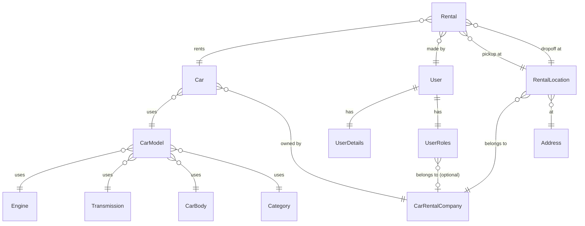
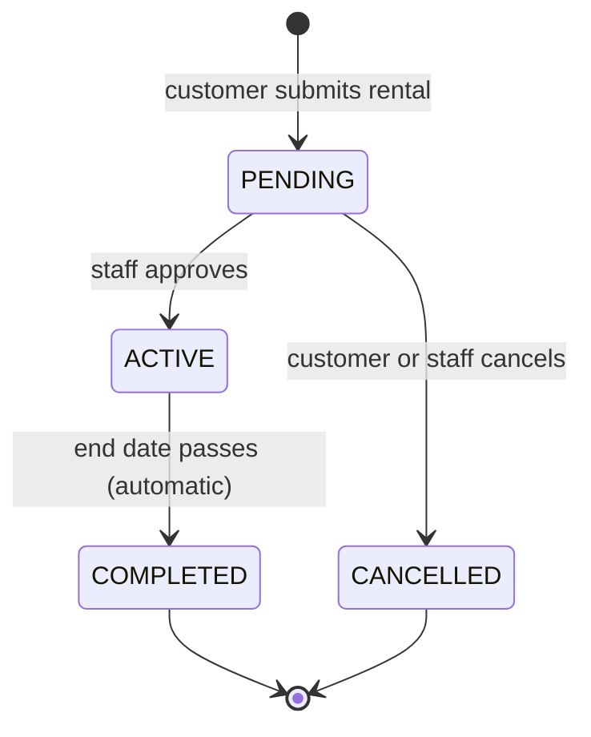
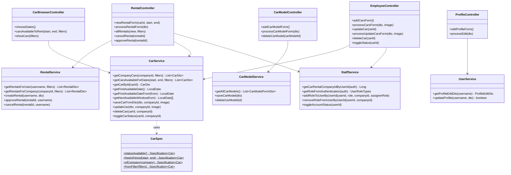

# Car Rental App 

Spring Boot web application for managing a car rental business. Supports multiple companies, roles, car fleet management, and customer rentals.

---

## Overview

### Functionality

The application covers two main domains:

**Fleet management** — Employees and managers manage the company's car fleet. Car models are built from reusable components (engine, transmission, car body, category). Individual cars reference a model and belong to a company. Cars can be added, updated, toggled between available/in-service, and deleted. Component pages show existing entries alongside the add form and prevent deletion of anything still referenced.

**Rentals** — Customers browse available cars for a chosen date range, filtered by brand, body type, category, transmission, traction type, and year. They submit a rental request with pickup/dropoff addresses and optional extras (driver, child seat). When a request is submitted, the server re-validates the booking (dates, car status, and overlap with existing rentals) before persisting it, so a tampered or stale form cannot double-book a car. Rentals start as `PENDING` and must be approved by staff to become `ACTIVE`. Customers can cancel their own `PENDING`/`ACTIVE` rentals; staff can approve and cancel only rentals belonging to their own company.

**Account management** — Users register, log in, and edit their own profile (name, email, phone, username, password). Managers manage their company's employees. A super-admin manages all accounts and companies platform-wide.

### Architecture

The application follows a standard layered MVC structure:

```
Browser → Controller → Service → Repository → Database
                   ↕
                  DTO
```

- **Controllers** handle HTTP routing, read request data into DTOs, delegate all logic to services, and pass DTOs to Thymeleaf templates. Entities never leave the service layer.
- **Services** own all business logic: validation, entity mapping, transactional writes, and access checks. Each service is responsible for one bounded area (cars, car models, engines, rentals, users, staff).
- **Repositories** are Spring Data JPA interfaces. Complex queries use JPQL `@Query`; simple existence checks use derived query methods (`existsByCategory_Id`).
- **Security** is enforced at the method level with `@PreAuthorize` on controller methods. Thymeleaf templates use `sec:authorize` to conditionally render staff-only UI.
- **Specifications** (`CarSpec`) compose JPA `Specification<Car>` predicates for dynamic car filtering, evaluated entirely at the database level.

---

## Diagrams

### Entity-Relationship Diagram



---

### Rental Status State Machine



---

### Class Diagram — Services & Controllers



---

## Tech Stack

| Layer | Technology |
|---|---|
| Backend | Spring Boot 4.0.5, Java 21 |
| Security | Spring Security 6, method-level `@PreAuthorize` |
| Persistence | Spring Data JPA / Hibernate, MySQL |
| Templates | Thymeleaf + Bootstrap 5.2.3 |
| Build | Maven |
| Runtime | Docker |

---

## Roles

No role hierarchy — each role is independent.

| Role | Description |
|---|---|
| `CUSTOMER` | Browse available cars, create and manage own rentals |
| `EMPLOYEE` | Manage company car fleet, car models and components |
| `MANAGER` | Employee permissions + manage company staff + approve rentals |
| `SUPER_ADMIN` | Platform-level admin: manage companies and all accounts |

---

## Domain Model

### Core Entities

| Entity | Table | Key Fields |
|---|---|---|
| `User` | `users` | `username`, `password`, `enabled` |
| `UserDetails` | `user_details` | `firstName`, `lastName`, `email`, `cnp`, `phoneNumber` |
| `UserRoles` | `user_roles` | `role` (enum), `carRentalCompany` (FK) |
| `CarRentalCompany` | `car_rental_company` | `name` |
| `Car` | `car` | `licencePlate`, `color`, `mileage`, `status`, `image` |
| `CarModel` | `car_model` | `brand`, `model`, `year`, `pricePerDay`, `traction`, `fuelConsumption`, `numberOfLuggage` |
| `Engine` | `engine` | `horsePower`, `engineCapacity`, `engineType` |
| `Transmission` | `transmission` | `transmissionName`, `transmissionType`, `numberOfGears` |
| `CarBody` | `car_body` | `name` (enum), `numberOfSeats`, `numberOfDoors` |
| `Category` | `category` | `categoryName`, `categoryDescription` |
| `Rental` | `rental` | `startDate`, `endDate`, `status`, `withDriver`, `childSeat` |
| `RentalLocation` | `rental_location` | `name`, `phoneNumber` |
| `Address` | `address` | `cityName`, `streetName`, `streetNumber` |

### Enums

| Enum | Values |
|---|---|
| `UserRoleTypes` | `CUSTOMER`, `EMPLOYEE`, `MANAGER`, `SUPER_ADMIN` |
| `CarStatus` | `AVAILABLE`, `RENTED`, `IN_SERVICE` |
| `RentalStatus` | `PENDING`, `ACTIVE`, `COMPLETED`, `CANCELLED` |
| `EngineTypes` | petrol / diesel / electric / hybrid variants |
| `TransmissionTypes` | manual / automatic variants |
| `CarBodyTypes` | sedan / SUV / hatchback / etc. |
| `TractionTypes` | `FWD`, `RWD`, `AWD` |

---

## Project Structure

```
src/main/java/com/carreantalapp/app/
├── configurations/
│   └── SecurityConfig.java
├── controllers/
│   ├── AuthController.java              GET /login
│   ├── HomeController.java              GET /home
│   ├── RegistrationController.java      GET/POST /registration/**
│   ├── ManageController.java            /admin/**, /manager/**
│   ├── EmployeeController.java          /employee/** (car CRUD)
│   ├── ProfileController.java           /profile/**
│   ├── RentalController.java            /rentals/**
│   └── car/
│       ├── CarBrowserController.java    /cars/**
│       ├── CarModelController.java      /employee/addCarModelForm, ...
│       └── components/
│           ├── EngineController.java
│           ├── TransmissionController.java
│           ├── CarBodyController.java
│           └── CategoryController.java
├── dto/
│   ├── CarDto.java
│   ├── CarFilterDto.java
│   ├── CarFormDto.java
│   ├── UpdateCarDto.java
│   ├── CarModelFormDto.java
│   ├── CarModelDropdownDto.java
│   ├── CarBodyDto.java
│   ├── CategoryDto.java
│   ├── EngineDto.java
│   ├── TransmissionDto.java
│   ├── RentalDto.java
│   ├── RentalFormDto.java
│   ├── WebUserDTO.java
│   ├── ProfileEditDto.java
│   ├── UserDto.java
│   └── CarRentalCompanyDto.java
├── exceptions/
│   ├── EngineInUseException.java
│   ├── TransmissionInUseException.java
│   ├── CarBodyInUseException.java
│   ├── CategoryInUseException.java
│   ├── CarModelInUseException.java
│   ├── CompanyNotFoundException.java
│   ├── UserNotFoundException.java
│   ├── RentalNotFoundException.java
│   └── RentalNotPendingException.java
├── model/                               JPA entities
├── repositories/                        Spring Data JPA interfaces
└── services/
    ├── CustomUserDetailsService.java
    ├── UserService.java
    ├── StaffService.java
    ├── RentalService.java
    └── car/
        ├── CarService.java
        ├── CarModelService.java
        ├── CarSpec.java
        └── components/
            ├── EngineService.java
            ├── TransmissionService.java
            ├── CarBodyService.java
            └── CategoryService.java
```

---

## URL Map

### Public
| Method | URL | Description |
|---|---|---|
| GET | `/login` | Login page |
| GET | `/registration/form` | Register new account |
| POST | `/registration/process` | Submit registration |

### All authenticated users
| Method | URL | Description |
|---|---|---|
| GET | `/home` | Home page with role-aware navigation |
| GET | `/profile/editProfile` | Edit own profile |
| POST | `/profile/processEdit` | Save profile changes |
| GET | `/cars/chooseDates` | Select rental period |
| GET | `/cars/carsAvailableToRent` | Browse available cars (filterable) |
| GET | `/rentals/newRental?carId=&start=&end=` | New rental confirmation form |
| POST | `/rentals/processRentalForm` | Submit new rental |
| GET | `/rentals/allRentals?view=client` | Own rental history |
| POST | `/rentals/cancelRental` | Cancel a PENDING rental |

### EMPLOYEE + MANAGER
| Method | URL | Description |
|---|---|---|
| GET | `/cars/showCars` | Company fleet with filters |
| GET | `/employee/addCarsForm` | Add car to fleet |
| POST | `/employee/processCarsForm` | Save new car |
| GET | `/employee/cars/updateCar?carId=` | Edit car details |
| POST | `/employee/processUpdateCarsForm` | Save car update |
| POST | `/employee/cars/toggleStatus` | Toggle `AVAILABLE` ↔ `IN_SERVICE` |
| POST | `/employee/cars/deleteCar` | Delete car |
| GET | `/employee/addCarModelForm` | Add car model, view/delete existing |
| POST | `/employee/processCarModelForm` | Save car model |
| POST | `/employee/deleteCarModel` | Delete car model (blocked if cars reference it) |
| GET | `/employee/addEngine` | Add engine, view/delete existing |
| POST | `/employee/processEngineForm` | Save engine |
| POST | `/employee/deleteEngine` | Delete engine (blocked if car models reference it) |
| GET | `/employee/addTransmission` | Add transmission, view/delete existing |
| POST | `/employee/processTransmissionForm` | Save transmission |
| POST | `/employee/deleteTransmission` | Delete transmission (blocked if car models reference it) |
| GET | `/employee/addCarBody` | Add car body, view/delete existing |
| POST | `/employee/processCarBodyForm` | Save car body |
| POST | `/employee/deleteCarBody` | Delete car body (blocked if car models reference it) |
| GET | `/employee/addCategory` | Add category, view/delete existing |
| POST | `/employee/proccesCategoryForm` | Save category |
| POST | `/employee/deleteCategory` | Delete category (blocked if car models reference it) |
| GET | `/rentals/allRentals?view=man/emp` | All company rentals |
| POST | `/rentals/approveRental` | Approve PENDING → ACTIVE |

### MANAGER
| Method | URL | Description |
|---|---|---|
| GET | `/manager/staff` | Manage company staff |

### SUPER_ADMIN
| Method | URL | Description |
|---|---|---|
| GET | `/admin/staff` | Manage all user accounts |
| GET | `/admin/rentalsCompanies/show` | Manage rental companies |

---

## Rental Flow

```
Customer                     System
   │                            │
   ├─ GET /cars/chooseDates ───►│ min date = first day with available car
   │◄──────────────────────────┤ choose-dates.html
   │                            │
   ├─ GET /cars/carsAvailableToRent?start=&end= ──►│ validate dates
   │  ┌─ no cars in period? ───────────────────────┤
   │◄─┘ redirect → chooseDates (error + next window hint)
   │◄──────────────────────────────────────────────┤ available-cars.html
   │  (filtered by CarSpec.freeInPeriod + status)  │
   │                            │
   ├─ GET /rentals/newRental?carId=&start=&end= ──►│
   │◄──────────────────────────────────────────────┤ new-rental-form.html
   │  (fill pickup/dropoff address, options)        │
   │                            │
   ├─ POST /rentals/processRentalForm ────────────►│ status = PENDING
   │◄──────────────────────────────────────────────┤ redirect → allRentals
   │                            │
   │          Staff             │
   ├─ POST /rentals/approveRental ────────────────►│ status = ACTIVE
   │                            │
   ├─ POST /rentals/cancelRental ─────────────────►│ status = CANCELLED
```

Rental status transitions:
- `PENDING` → `ACTIVE` (staff of the owning company approves)
- `PENDING` or `ACTIVE` → `CANCELLED` (customer cancels own rental; staff cancels rentals of their own company)
- `ACTIVE` → `COMPLETED` (automatic, when end date passes)

---

## Key Design Decisions

### DTO Pattern
Entities are **never** passed to Thymeleaf templates. Every controller method maps entities to DTOs before adding them to the model, preventing lazy-loading exceptions and decoupling the view from the persistence layer.

### Rental Completion Scheduler

A `@Scheduled(cron = "0 0 0 * * *", zone = "Europe/Bucharest")` job runs at midnight every day and marks all `ACTIVE` rentals whose `endDate < today` as `COMPLETED`. `@EnableScheduling` is enabled on `AppApplication`.

An `@EventListener(ApplicationReadyEvent.class)` method runs the same logic at every application startup, so rentals that expired while the container was stopped are completed immediately before any request is served.

### Global Exception Handler

`GlobalExceptionHandler` (`@ControllerAdvice`) catches:
- `UserNotFoundException`, `CompanyNotFoundException`, `RentalNotFoundException` → HTTP 404
- `AccessDeniedException` (a `@PreAuthorize` rejection) → HTTP 403
- `IllegalStateException` (e.g. cancelling someone else's rental, or acting on another company's rental/car/staff) → HTTP 403
- Any other `Exception` → HTTP 500

All cases render `error.html` with the status code and a human-readable message.

> The `AccessDeniedException` handler is required, not optional. `@PreAuthorize` is
> evaluated while the controller method is being invoked, so the exception reaches
> `@ControllerAdvice` before Spring Security's `ExceptionTranslationFilter` can turn
> it into a 403. Without an explicit handler the catch-all `Exception` branch claims
> it and every unauthorized request answers **500** instead of 403. CSRF rejections
> are unaffected — those happen in the filter chain, before the DispatcherServlet.

### `RentalLocation` Deduplication

`RentalService.buildLocation` no longer creates duplicate addresses. It first checks `AddressRepository.findByCityNameAndStreetNameAndStreetNumber` and `RentalLocationRepository.findByAddressAndCarRentalCompany` before inserting, so repeated rentals to the same address reuse existing rows.

### Date Availability Validation

`chooseDates` computes the first day (from today) where at least one car is available using `CarService.getFirstAvailableDate()` and sets it as the HTML5 `min` on the start date input — no JavaScript required.

When the customer submits a date range, `carsAvailableToRent` first checks if any car is free for the whole period (ignoring filters). If none exist, the controller redirects back to `chooseDates` with a message indicating the next available window:

```
No cars available from 2026-06-22 to 2026-06-25. Next available window: 2026-06-27 to 29.
```

`getNextAvailableWindow(from)` finds the first available start date, then extends it forward day by day until no car is free, giving the length of the contiguous available block. If months differ, the full date is shown for the end too.

Only if cars exist (regardless of filters) does the browser proceed to `available-cars.html`. The "No available cars with the selected filters" message on that page therefore means cars exist for the period but none match the active filters.

### Booking Integrity Validation

Availability is filtered at browse time, but the browse result can be stale or the form can be replayed/tampered with a different `carId` or date range. To prevent double-booking and bookings on unavailable cars, `RentalService.createRental` re-validates server-side before persisting:

- start/end dates are present, start is not in the past, and end is after start;
- the car's status is `AVAILABLE`;
- no non-cancelled rental overlaps the requested period (`RentalRepository.existsOverlappingRental`).

Any failed check throws an exception that the controller surfaces back on the form.

### Company-Scoped Authorization

`@PreAuthorize` guards *which roles* may reach an endpoint, but not *which records* they may act on. Because IDs travel in request parameters, an `EMPLOYEE`/`MANAGER` of one company could otherwise act on another company's records by guessing an ID. Every staff write therefore re-checks that the target belongs to the caller's own company (derived from `StaffService.getCarRentalCompanyIdByUserId(auth)`), throwing `IllegalStateException` (→ HTTP 403) on mismatch:

| Operation | Ownership check |
|---|---|
| `RentalService.approveRental` / `cancelRental` (staff) | rental's car company == caller's company |
| `CarService.updateCar` / `deleteCar` / `toggleCarStatus` / `toUpdateDto` | car's company == caller's company |
| `StaffService.removeRoleFromUserByUserId` | target employee's company == caller's company |

Customers remain restricted to their own rentals; `SUPER_ADMIN` is unscoped by design.

### `allRentals` View Security

The `/rentals/allRentals` endpoint serves two views: `client` (own rentals) and `emp`/`man` (all company rentals). A `CUSTOMER` who manually appends `?view=emp` is silently redirected to `?view=client` before any staff-only service call is made.

### DB-Level Filtering — `CarSpec`
`CarSpec` is a static class of `Specification<Car>` predicates composed with `Specification.where().and()`. All filtering (brand, body type, category, transmission, traction, year range, availability) happens at the database level via `JpaSpecificationExecutor`.

```java
Specification<Car> spec = Specification.where(CarSpec.statusAvailable())
        .and(CarSpec.freeInPeriod(start, end))
        .and(CarSpec.fromFilter(filters));
carRepository.findAll(spec);
```

### Delete Safety
Before deleting any shared component (Engine, Transmission, CarBody, Category, CarModel), the service checks for references. If found, it throws a custom exception caught by the controller and shown as a flash warning. The delete is blocked without cascading side-effects.

| Deleted entity | Blocked if... |
|---|---|
| Engine | any CarModel references it |
| Transmission | any CarModel references it |
| CarBody | any CarModel references it |
| Category | any CarModel references it |
| CarModel | any Car in the application fleet references it |

### Service Decoupling
`CarModelController` injects 5 services independently. No service calls another service — each owns its own data. This avoids circular dependencies and keeps services independently testable.

### Profile Edit & Session Management
`UserService.updateProfile()` returns `true` if the username or password changed. When `true`, `ProfileController` clears the `SecurityContext`, invalidates the HTTP session, and redirects to `/login?passwordChanged`, forcing re-authentication with the new credentials.

### Multipart Upload
Car images are stored on disk under `app.upload-dir` and served under `/uploads/**`. Max size: 10 MB per file.

---

## Configuration

`src/main/resources/application.properties`:

```properties
spring.datasource.url=${SPRING_DATASOURCE_URL:jdbc:mysql://localhost:3307/car_rental}
spring.datasource.username=${SPRING_DATASOURCE_USERNAME:car_rental_user}
spring.datasource.password=${SPRING_DATASOURCE_PASSWORD:}

spring.jpa.hibernate.ddl-auto=validate

app.upload-dir=/uploads
spring.servlet.multipart.max-file-size=10MB
spring.servlet.multipart.max-request-size=15MB
```
### Database Migrations

The database schema is managed using Flyway.

| Script                                           | Purpose                                                               |
|--------------------------------------------------|-----------------------------------------------------------------------|
| `resources/db/migration/V1__initial_schema.sql`  | Full schema definition                                                |
| `resources/db/migration/V2__initial_data.sql`    | Demo dataset: company, accounts, components, car models, and vehicles |
| `resources/db/migration/V3__seed_super_admin.sql`| Bootstrap `SUPER_ADMIN` account — required, see **Demo Accounts**     |

Both scripts run automatically at startup — Flyway applies any migration not yet
recorded in the `flyway_schema_history` table. No manual import is needed.

> **Never edit a migration that has already been applied.** Flyway stores a checksum
> of each script and refuses to start if the file no longer matches
> (`Migration checksum mismatch`). Changing even a comment triggers this. If it
> happens, either restore the file or refresh the checksums:
>
> ```bash
> ./mvnw org.flywaydb:flyway-maven-plugin:repair \
>   -Dflyway.url=jdbc:mysql://localhost:3307/car_rental \
>   -Dflyway.user=car_rental_user -Dflyway.password=car_rental \
>   -Dflyway.locations=filesystem:src/main/resources/db/migration
> ```
>
> Repair only rewrites checksums — it does not re-apply the script, so use it only
> when the change was cosmetic. If the schema itself changed, add a new `V3__…`
> migration instead.

`src/main/resources/data.sql` is a pre-Flyway seed script kept for reference only.
It is not executed (`spring.sql.init.mode` is disabled) and is the sole place where
a `SUPER_ADMIN` account is defined.

## Running with Docker

```bash
docker compose up --build
```
### Demo Accounts

The following accounts are created by the database seed script.

**Password for all accounts:** `admin`

| Username | Role | Company | Seeded by |
|---|---|---|---|
| `admin` | SUPER_ADMIN | — | `V3__seed_super_admin.sql` |
| `manager1` | MANAGER | AutoRent SRL | `V2__initial_data.sql` |
| `employee1` | EMPLOYEE | AutoRent SRL | `V2__initial_data.sql` |
| `customer1` | CUSTOMER | — | `V2__initial_data.sql` |

> **The `admin` account is not optional demo data — it is a bootstrap requirement.**
> `StaffService.validateRoleAssignment` refuses to grant any role whose ordinal is
> greater than or equal to the assigner's, and `SUPER_ADMIN` is the highest, so the
> role can never be granted through the UI — not even by another `SUPER_ADMIN`. Since
> only a `SUPER_ADMIN` can promote a `MANAGER`, and only a `MANAGER` can promote an
> `EMPLOYEE`, a database without this seeded account can never have any staff at all:
> `/admin/**`, `/manager/**` and `/employee/**` stay permanently unreachable and only
> self-registered customers exist. Change the password after the first login.

### Database Configuration

Set the following environment variables in Docker to override the default database configuration:

```text
SPRING_DATASOURCE_URL
SPRING_DATASOURCE_USERNAME
SPRING_DATASOURCE_PASSWORD
```

App available at `http://localhost:8080`.

After code changes:

```bash
docker compose down
docker compose up --build
```

---


## Testing

### Test Suite

136 tests across eight classes. Only one of them needs a database, and it starts its
own.

| Test class | Type | Tests | Needs a database |
|---|---|---|---|
| `services/StaffServiceTest` | Unit (Mockito) | 32 | No |
| `services/RentalServiceTest` | Unit (Mockito) | 31 | No |
| `services/car/CarServiceTest` | Unit (Mockito) | 29 | No |
| `security/RoleAccessTest` | Web slice (`@WebMvcTest`) | 18 | No |
| `services/UserServiceTest` | Unit (Mockito) | 15 | No |
| `services/car/components/ComponentDeleteGuardsTest` | Unit (Mockito) | 8 | No |
| `services/car/CarModelServiceTest` | Unit (Mockito) | 2 | No |
| `AppApplicationTests` | Spring Boot context | 1 | Yes (Testcontainers) |

The unit tests mock every repository and drive the service directly — no Spring
context, no database, no Docker. Each class is grouped into `@Nested` blocks, one per
service method, so a failure names the method that broke.

`AppApplicationTests.contextLoads()` boots the full Spring context, exercising the
real datasource, the Flyway migrations and `ddl-auto=validate`. It is the only test
requiring MySQL, and it is what catches drift between the JPA entities and the schema
the migrations produce.

### Running the Tests

```bash
./mvnw test
```

That is the whole command. No database to start, no environment variable to export —
`AppApplicationTests` starts its own MySQL through Testcontainers (see below), and
everything else runs on mocks. Docker must be running for the one container-backed
test.

To skip the container entirely and run only the mock-based tests:

```bash
./mvnw test -Dtest='*ServiceTest,*GuardsTest,RoleAccessTest'
```

### Database-backed Tests (Testcontainers)

`AppApplicationTests` declares a `MySQLContainer` in `TestcontainersConfiguration`,
wired in with `@ServiceConnection` so Spring Boot points the datasource at the
container automatically:

```java
@Bean
@ServiceConnection
MySQLContainer<?> mysqlContainer() {
    return new MySQLContainer<>(DockerImageName.parse("mysql:8.0"));
}
```

The image matches `docker-compose.yaml`, so the test runs the same MySQL version as
production. Two properties follow from this:

- **No credentials to configure.** The container publishes its own, and
  `@ServiceConnection` overrides `spring.datasource.*` for the test context. The
  `SPRING_DATASOURCE_PASSWORD` variable is only needed to run the *application*
  against the compose database, never to run the tests.
- **Flyway checksum drift cannot happen.** Every run starts from an empty volume, so
  both migrations apply from scratch (`Successfully applied 2 migrations to schema
  'test'`). The mismatch described under **Database Migrations** only affects
  long-lived development databases, never CI.

Note the Testcontainers 2.x artifact names — `testcontainers-mysql` and
`testcontainers-junit-jupiter`, not the 1.x `mysql` / `junit-jupiter`.

### Continuous Integration

`.github/workflows/ci.yml` runs the full suite on every push and pull request against
`main`: JDK 21 (Temurin) with a cached Maven repository, then `./mvnw -B -ntp test`.
Surefire reports are uploaded as a build artifact and kept for 7 days, so a failure is
readable without re-running anything locally.

GitHub's `ubuntu-latest` runners ship with Docker, so the Testcontainers test works
there with no extra setup. `mvnw` is stored with its executable bit set (mode `100755`)
— without it the runner fails with `permission denied`.

### Service Coverage

**`RentalServiceTest` — 30 tests, all 8 public methods.** The rental rules are where a
defect costs the most: wrong prices, double bookings, staff acting across company
boundaries.

- `createRental` (8) — every rejection path is pinned: missing dates, a start date in
  the past, an end date not after the start, a car that is not `AVAILABLE`, an
  overlapping booking, an unknown user. Each rejection also asserts nothing was
  persisted. The success path captures the saved `Rental` and checks it is stored as
  `PENDING` with the right car, user, dates and extras. Two tests cover
  `buildLocation`: existing addresses and locations are reused rather than
  duplicated, and a city name longer than 50 characters is truncated to fit the column.
- `approveRental` (4) — `PENDING` becomes `ACTIVE`; any other state raises
  `RentalNotPendingException`; staff from another company, or with no company, are
  rejected and the status stays untouched.
- `cancelRental` (5) — a customer cancels their own rental but not someone else's; a
  `COMPLETED` rental cannot be cancelled; a manager cancels an `ACTIVE` rental of
  their own company; staff of another company cannot.
- `getRentalsForUser` (5) — pins the DTO mapping end to end, including the derived
  price (3 days × 100 = 300) and the `"City, Street Number"` address format, then the
  filter logic: no status filter returns everything, selected statuses combine as OR,
  `driverOnly` narrows to rentals with a driver.
- `getRentalsForCompany` (3), `getAllRentals` (2), `completeExpiredRentals` (3) —
  company scoping and filters, unfiltered mapping, and the scheduled sweep that flips
  expired `ACTIVE` rentals to `COMPLETED` (including the startup listener).

**`StaffServiceTest` — 32 tests, all 10 public methods.** Role assignment is the
privilege-escalation surface.

- `addRoleToUserByUserId` (8) — a MANAGER cannot assign MANAGER or SUPER_ADMIN but
  can assign EMPLOYEE and CUSTOMER; a SUPER_ADMIN can assign MANAGER. Because the
  guard compares `UserRoleTypes.ordinal()`, these tests fail loudly if anyone
  reorders the enum. Staff roles without a company raise `CompanyRequiredException`;
  demoting to CUSTOMER clears the company.
- `removeRoleFromUserByUserId` (3) — resets an own-company employee to CUSTOMER;
  rejects employees of another company and users with no company.
- `searchUsers` (4) and `searchUsersForCompany` (3) — blank and null terms take the
  `findAll` / empty-list branches; the company-scoped search never touches a
  repository when the term is blank.
- `getRoleFromAuthentication` (3), `getCarRentalCompanyIdByUserId` (5),
  `getEmployeesOfCompany` (2), `toggleAccountStatus` (2), `getCompanyNameById` (2).

**`CarServiceTest` — 29 tests.** Fleet management plus the availability algorithms.

- Company ownership (5) — `updateCar`, `deleteCar`, `toggleCarStatus` and
  `toUpdateDto` all refuse cars of another company, including a `null` company id.
- `deleteCar` (3) — blocked while `PENDING` or `ACTIVE` rentals exist.
- `toggleCarStatus` (3) — `AVAILABLE` ↔ `IN_SERVICE`, and a `RENTED` car cannot be
  toggled.
- `saveCarFromDto` / `updateCar` (6) — unknown company and unknown car model, the
  null and empty image branches, and a real upload written to a `@TempDir` whose
  stored path is checked to start with `/uploads/`.
- Availability windows (7) — `getFirstAvailableDateFrom` falling back to its start
  date, `getNextAvailableWindow` extending until the first unavailable day,
  `getUpcomingAvailableWindows(0)`, and `getBestWindowWithin` returning `null`,
  picking the longest contiguous block, and keeping a block that runs to the end.

**`UserServiceTest` — 15 tests, all 5 public methods.** `register` asserts the stored
password is the encoded value and never the plaintext. `updateProfile` covers the
wrong current password, a username already taken, a new password under 6 characters,
a blank new password leaving the hash untouched, and the `true`/`false` return that
tells `ProfileController` whether to force re-authentication.

**Delete guards — 10 tests.** Shared components are referenced by many car models, and
cars reference car models, so deleting one out from under its users would leave broken
foreign keys. Each guard is covered twice: the delete is refused with the matching
`…InUseException` while a reference exists (asserting `deleteById` is never reached),
and it proceeds when nothing references the row.

| Guard | Blocked when |
|---|---|
| `EngineService.deleteEngine` | any `CarModel` uses the engine |
| `TransmissionService.deleteTransmission` | any `CarModel` uses the transmission |
| `CarBodyService.deleteCarBody` | any `CarModel` uses the body |
| `CategoryService.deleteCategory` | any `CarModel` uses the category |
| `CarModelService.deleteCarModel` | any `Car` uses the model |

These guards are not reachable through the add-car flow — that path goes straight to
the repositories — so without these tests the checks were entirely unverified.

### Role Access Coverage

`RoleAccessTest` is a `@WebMvcTest` slice with every service replaced by
`@MockitoBean`, `SecurityConfig` imported explicitly (without it `@EnableMethodSecurity`
never activates and every `@PreAuthorize` would silently pass), and roles simulated
with `@WithMockUser`.

| Case | Expected |
|---|---|
| Unauthenticated on any protected route | redirect to `/login` |
| `/login`, `/registration/form` anonymous | 200 |
| CUSTOMER on `/admin/**`, `/employee/**`, `/manager/**`, `/cars/showCars` | 403 |
| CUSTOMER posting to `/rentals/approveRental` | 403 |
| EMPLOYEE on `/admin/**` and `/manager/staff` | 403 |
| MANAGER on `/admin/**` | 403 |
| SUPER_ADMIN on `/employee/**`, `/cars/chooseDates`, `/cars/showCars` | 403 |
| POST without a CSRF token | 403 |
| CUSTOMER on `/rentals/allRentals?view=emp` or `?view=man` | redirect to `?view=client` |

The last row is not protected by an annotation but by a manual `isStaff` check inside
`RentalController.allRentals` — exactly the kind of logic that breaks silently during
a refactor.

### Test Dependencies

Spring Boot 4 splits the test slices into separate modules, so two dependencies are
required beyond `spring-boot-starter-test`:

| Dependency | Why |
|---|---|
| `spring-boot-starter-webmvc-test` | provides `@WebMvcTest`, which moved to `org.springframework.boot.webmvc.test.autoconfigure` |
| `spring-boot-starter-security-test` | provides `SecurityMockMvcAutoConfiguration`; without it `@WithMockUser` is ignored and every request is treated as anonymous |

### Known Warning

Mockito prints a self-attaching agent warning on startup. It is harmless today but
will stop working on future JDKs; silencing it means registering `mockito-core` as a
`-javaagent` in the Surefire configuration.

### Not Yet Covered

- No repository tests (`@DataJpaTest`) — the custom JPQL in `RentalRepository` and
  `UserRepository` is only exercised indirectly through mocks.
- No `CarSpec` tests against a real database; the specifications are verified only as
  opaque arguments.
- No end-to-end rental flow test (browse → book → approve).
- `CarRentalCompanyService` and `CustomUserDetailsService` have no unit tests.
- For the component services and `CarModelService` only the delete guards are tested;
  their `saveX()` and `getAllX()` methods are not. In particular the four
  missing-dependency branches in `CarModelService.saveCarModel` (unknown engine,
  transmission, body or category) are unverified.
- No coverage tool is configured, so the numbers above are test counts, not line
  coverage.
